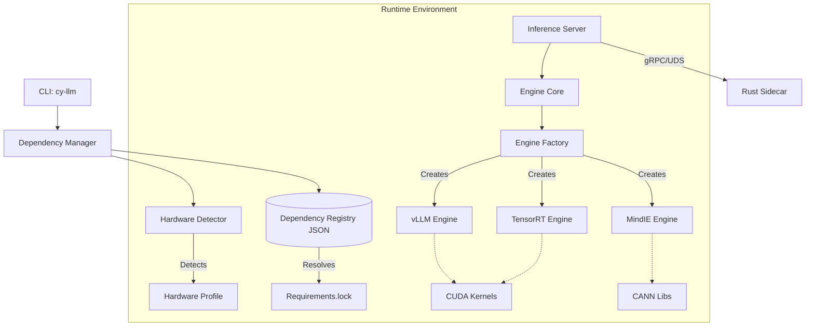

# Technical Design: CY-LLM Engine Refactoring
- Mode: REFACTOR
- Source: docs/refactor/cy-llm-engine/RefactorGoals.md

## 0. Architecture Summary
- **System Boundary**: Python Worker process responsible for LLM inference, exposing gRPC/UDS interface to Sidecar/Gateway.
- **Key Constraints**:
  - **Dependency Hell**: Strict isolation of engine dependencies via a "Registry" based approach.
  - **Hardware Diversity**: Auto-detection and runtime configuration for NVIDIA/Ascend/CPU.
  - **Performance**: Configurable tuning parameters (KV cache, quantization) per model/hardware.
- **Top Risks**:
  - `protobuf` version conflict (vLLM requires 6.x, Base requires <6.x).
  - Migration of existing stateful components (TaskScheduler) during directory merge.

## 1. Architecture Overview
### 1.1 Component Diagram (Mermaid)


### 1.2 Technology Choices
- **Dependency Registry**: `deploy/dependency_registry.json` (JSON)
  - **Why**: Allows adding new hardware/engines/versions without modifying code. Supports explicit download URLs (wheels) for non-PyPI artifacts (e.g., specific torch-cu124).
- **Package Management**: Standard `pip` + `requirements.txt` generation
  - **Why**: flexible, universal. We generate `requirements.lock` dynamically based on the Registry.
- **Engine Interface**: Python Abstract Base Class (`abc`)
  - **Why**: Enforces contract for `load_model`, `stream_predict` across disparate backends.

## 2. Module Breakdown

### Module: Dependency Manager (`src/cy_llm/deps`)
- **Purpose**: Solve "Dependency Hell". manage environments.
- **Responsibilities**:
  - Detect Hardware (NVIDIA/AMD/Ascend/CPU).
  - Read `dependency_registry.json`.
  - Resolve valid (Hardware + Engine) combinations.
  - Generate `requirements.txt` with specific version pins and wheel URLs.
- **Interfaces**:
  - `detect_hardware() -> HardwareProfile`
  - `resolve_dependencies(profile, engine_type) -> RequirementSet`
  - `verify_environment() -> bool`

### Module: Engine Core (`src/cy_llm/engines`)
- **Purpose**: Unified inference interface.
- **Responsibilities**:
  - Abstract away backend differences (vLLM vs TRT vs MindIE).
  - Handle Model Loading (with retries/fallback).
  - Manage Inference Loop (Streaming).
- **Interfaces**:
  - `API-ENGINE-1`: `BaseEngine` (ABC)
  - `API-ENGINE-2`: `EngineFactory`

### Module: Server Core (`src/cy_llm/core`)
- **Purpose**: Request handling and orchestration.
- **Responsibilities**:
  - gRPC Service Implementation (matches `proto/inference.proto`).
  - Task Scheduling (Queueing, Batching strategy).
  - Memory Management (VRAM monitoring).
- **Dependencies**: `rust_core` (via UDS), `engines`.

## 3. Interfaces (Contract Summary)

### API-DEPS-1: Dependency Registry Schema
*External Configuration File: `deploy/dependency_registry.json`*
```json
{
  "hardware_profiles": {
    "nvidia_ampere": { "vendor": "nvidia", "min_compute_capability": "8.0" },
    "ascend_910b": { "vendor": "huawei", "soc_version": "Ascend910B" }
  },
  "engines": {
    "vllm": { "default_version": "0.12.0" },
    "tensorrt_llm": { "default_version": "0.9.0" }
  },
  "wheels": {
    "torch-2.1.2+cu121": "https://download.pytorch.org/whl/cu121/torch-2.1.2%2Bcu121-cp310-cp310-linux_x86_64.whl"
  },
  "compatibility_matrix": [
    {
      "hardware": "nvidia_ampere",
      "engine": "vllm",
      "dependencies": [
        "vllm==0.12.0",
        "protobuf==6.33.4", 
        {"wheel": "torch-2.1.2+cu121"}
      ]
    }
  ]
}
```

### API-ENGINE-1: BaseEngine Interface
*Python Interface*
```python
class BaseEngine(ABC):
    @abstractmethod
    def load_model(self, model_path: str, **kwargs) -> None:
        """Loads model into memory. Raises EngineError on failure."""
        pass

    @abstractmethod
    def stream_predict(self, prompt: str, **kwargs) -> Generator[str, None, None]:
        """Yields generated tokens. Handles thread safety internally."""
        pass

    @abstractmethod
    def unload_model(self) -> None:
        """Frees all associated resources (VRAM/RAM)."""
        pass
        
    @abstractmethod
    def get_memory_usage(self) -> float:
        """Returns current VRAM usage in GB."""
        pass
```

### API-SERVER-1: gRPC Service
*Existing Interface (Frozen)*
- **Service**: `InferenceService`
- **Method**: `StreamPredict(Request) -> stream Response`
- **Auth**: None (Relies on UDS isolation / Sidecar).

## 4. Data Models

### 4.1 Hardware Profile
```python
@dataclass
class HardwareProfile:
    vendor: Literal["nvidia", "amd", "ascend", "cpu"]
    device_name: str  # e.g., "NVIDIA A100-SXM4-40GB"
    vram_total: int   # Bytes
    compute_capability: Optional[str] = None # e.g. "8.0" for Ampere
    driver_version: str
```

### 4.2 Engine Config
```python
@dataclass
class EngineConfig:
    engine_type: str
    model_id: str
    max_model_len: int = 8192
    gpu_memory_utilization: float = 0.90
    quantization: Optional[str] = None
    # Engine specific extras
    extra_config: Dict[str, Any] = field(default_factory=dict)
```

## 5. Key Flows

### Flow 1: Setup & Install
1. **User** runs `./cy-llm setup`.
2. **CLI** calls `HardwareDetector.detect()`.
3. **Detector** identifies `NVIDIA RTX 4090`.
4. **CLI** consults `dependency_registry.json` for `nvidia` + `rtx4090`.
5. **Registry** suggests `vllm-0.12.0-cu121` (High Perf) or `trt-llm-0.9.0` (Low Latency).
6. **User** selects `vllm`.
7. **CLI** resolves full dependency tree from Registry (including specific `protobuf` version).
8. **CLI** generates `requirements.lock` and runs `pip install -r ...`.

### Flow 2: Inference Request
1. **Gateway** sends gRPC request to **Rust Sidecar**.
2. **Sidecar** forwards via UDS to **Python Worker (Server)**.
3. **Server** receives `StreamPredict` request.
4. **Server** checks `TaskScheduler` (Concurrnecy Limit).
5. **Scheduler** assigns task to `VLLMEngine.stream_predict`.
6. **Engine** runs inference, yields tokens.
7. **Server** streams tokens back to Sidecar -> Gateway.

## 6. Cross-Cutting Concerns

- **Performance Tuning**:
  - The `dependency_registry.json` allows defining "Performance Presets".
  - Engine implementations must report metrics (Latnecy, Throughput) to `Telemetry` module.
- **Error Handling**:
  - Unified `EngineError` hierarchy.
  - OOM (Out Of Memory) must be caught and reported as specific error code, triggering `unload_model` or GC.
- **Observability**:
  - Rust Sidecar handles metrics export (Prometheus).
  - Python Worker logs structured logs (JSON) to stdout/stderr.

## 7. Migration Plan

### Phase 1: Directory Consolidation
- **Goal**: Merge `src/cy_llm` and `CY_LLM_Backend` into strict `src/cy_llm` structure.
- **Action**: 
  - Move `CY_LLM_Backend/worker/*` to `src/cy_llm/worker/*`.
  - Resolve duplicate files (prefer `CY_LLM_Backend` versions as they seem more active/tested).
  - Update `sys.path` in entry points.

### Phase 2: Dependency System
- **Goal**: Implement Registry and Detector.
- **Action**:
  - Create `deploy/dependency_registry.json`.
  - Implement `src/cy_llm/deps/`.
  - Create CLI `cy-llm setup`.

### Phase 3: Engine Refactor
- **Goal**: Formalize `BaseEngine`.
- **Action**:
  - Refactor `vllm_engine.py`, `trt_engine.py` to inherit strictly from `BaseEngine`.
  - Remove legacy adapter code.

## 8. Requirements Traceability
| Module | Requirement | Description |
|---|---|---|
| DependencyManager | G1 | Intelligent dependency management & compatibility matrix |
| HardwareDetector | G1, G3 | Auto-detect hardware (NVIDIA/Ascend) |
| EngineCore | G3 | Runtime selection of engines |
| DirectoryStructure | G2 | Eliminate directory clutter (src vs Backend) |
| Registry | User-Req | Database/File for download links and versions |
