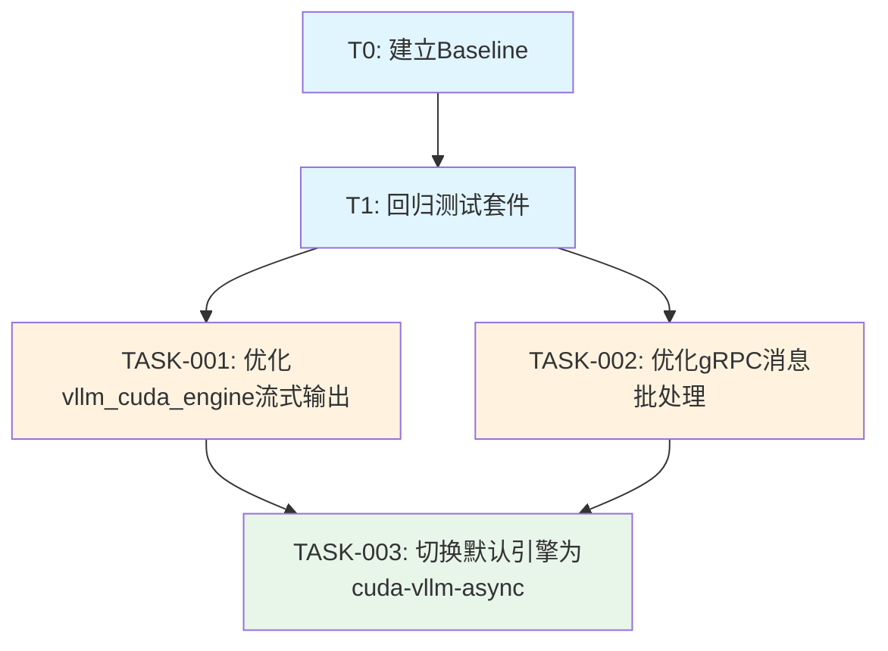

# Token Speed Optimization - Task Board

## 项目信息
- **项目名称**: CY-LLM Engine Token Speed Optimization
- **重构目标**: Token速度从15-20 t/s提升至≥50 t/s
- **项目路径**: `/home/baijin/Dev/CY-LLM-Engine`
- **文档位置**: `docs/refactor/token-speed-optimization/`
- **关联文档**:
  - [RefactorGoals.md](./RefactorGoals.md) - 重构目标与非目标
  - [InterfaceContract.md](./InterfaceContract.md) - 接口契约与变更审批
  - [ProjectMeta.md](./ProjectMeta.md) - 项目元信息

---

## 执行摘要

| 指标 | 当前值 | 目标值 | 提升倍数 |
|------|--------|--------|----------|
| Token速度 | 15-20 t/s | ≥50 t/s | 2.5-3.3x |
| TTFT | ~500ms | ≤200ms | 2.5x |
| 任务总数 | - | 5 | - |
| 预计工期 | - | 2-3周 | - |

---

## 里程碑 (Milestones)

| 里程碑 | 名称 | 包含任务 | 完成标准 |
|--------|------|----------|----------|
| M0 | 准备阶段 | T0 | 基线数据记录完成，测试脚本可运行 |
| M1 | 测试保护 | T1 | 回归测试套件100%通过，性能测试就绪 |
| M2 | 核心重构 | TASK-001, TASK-002 | 流式优化完成，速度提升验证通过 |
| M3 | 默认切换 | TASK-003 | 异步引擎成为默认，兼容性验证通过 |
| M4 | 验证交付 | 全部 | 所有验收指标达标，文档更新完成 |

---

## 任务依赖图



---

## 任务清单 (Task List)

### T0: 建立Baseline (准备阶段)

| 属性 | 值 |
|------|-----|
| **任务ID** | T0 |
| **任务名称** | 建立Baseline |
| **优先级** | P0-Critical |
| **预估工期** | 0.5-1天 |
| **依赖任务** | 无 |
| **阻塞任务** | T1, TASK-001, TASK-002, TASK-003 |

#### 目标
建立可重复的性能基线测量环境，记录当前系统状态，为后续优化提供对比基准。

#### 范围
- ✅ 创建基准测试脚本 `scripts/benchmark_token_speed.py`
- ✅ 记录当前性能基线（15-20 t/s）
- ✅ 记录系统环境信息（GPU型号、vLLM版本、CUDA版本等）
- ✅ 创建测试数据集（标准化prompts）
- ✅ 记录构建和测试命令

#### 非范围
- ❌ 修改任何生产代码
- ❌ 引入新的依赖包

#### 完成的定义 (DoD)
- [x] 基准测试脚本可成功运行并输出JSON格式结果
- [x] 基线数据记录在 `docs/refactor/token-speed-optimization/baseline_report.md`
- [x] 至少运行3次取平均值，标准差<10%
- [x] 环境信息完整记录（包括随机种子）

#### 验证命令
```bash
# 运行基准测试
python scripts/benchmark_token_speed.py --model deepseek-ai/deepseek-llm-7b-chat --output baseline.json

# 验证输出格式
python -c "import json; d=json.load(open('baseline.json')); assert 'tokens_per_sec' in d; print(f'Baseline: {d[\"tokens_per_sec\"]:.2f} t/s')"
```

#### 交付物
| 文件路径 | 说明 |
|----------|------|
| `scripts/benchmark_token_speed.py` | 基准测试脚本 |
| `docs/refactor/token-speed-optimization/baseline_report.md` | 基线报告 |
| `docs/refactor/token-speed-optimization/test_data/` | 测试数据集 |

#### 风险等级
🟢 **低风险** - 仅添加测试脚本，不影响生产代码

#### 关联文档
- [RefactorGoals.md - 性能指标](./RefactorGoals.md#性能指标)
- [ProjectMeta.md - 当前性能基线](./ProjectMeta.md#当前性能基线)

---

### T1: 回归测试套件 (测试保护)

| 属性 | 值 |
|------|-----|
| **任务ID** | T1 |
| **任务名称** | 回归测试套件 |
| **优先级** | P0-Critical |
| **预估工期** | 1-2天 |
| **依赖任务** | T0 |
| **阻塞任务** | TASK-001, TASK-002, TASK-003 |

#### 目标
建立全面的回归测试保护，确保重构过程中API兼容性不丢失，功能完整性得到保障。

#### 范围
- ✅ 创建 `tests/integration/test_streaming_performance.py`
- ✅ 创建 `tests/unit/test_vllm_cuda_engine_streaming.py`
- ✅ 验证API兼容性（OpenAI兼容格式）
- ✅ 创建性能回归测试（速度阈值检查）
- ✅ 准备功能回归测试用例集

#### 非范围
- ❌ 修复发现的现有bug（除非阻塞测试）
- ❌ 覆盖未修改的模块

#### 完成的定义 (DoD)
- [x] 新增单元测试通过率100%
- [x] 新增集成测试通过率100%
- [x] 性能测试可检测Token速度下降（阈值：<40 t/s视为失败）
- [x] 所有测试可在CI环境中运行
- [x] API兼容性测试覆盖所有冻结接口（见InterfaceContract.md）

#### 验证命令
```bash
# 运行单元测试
pytest tests/unit/test_vllm_cuda_engine_streaming.py -v

# 运行集成测试
pytest tests/integration/test_streaming_performance.py -v --timeout=300

# 运行性能回归测试
pytest tests/performance/ -m performance --benchmark-only

# 全量回归测试
pytest tests/ -xvs -k "not slow"
```

#### 测试用例清单

| 测试ID | 测试名称 | 类型 | 优先级 |
|--------|----------|------|--------|
| TC-001 | 验证infer()返回Generator | Unit | P0 |
| TC-002 | 验证流式输出不为空 | Unit | P0 |
| TC-003 | 验证token块大小配置生效 | Unit | P1 |
| TC-004 | 验证gRPC消息格式兼容性 | Integration | P0 |
| TC-005 | 验证TTFT < 500ms | Performance | P0 |
| TC-006 | 验证Token速度 ≥50 t/s | Performance | P0 |
| TC-007 | 验证多并发请求处理 | Integration | P1 |
| TC-008 | 验证LoRA切换功能完整 | Integration | P1 |
| TC-009 | 验证引擎回退机制 | Integration | P1 |
| TC-010 | 验证显存释放正确 | Unit | P1 |

#### 交付物
| 文件路径 | 说明 |
|----------|------|
| `tests/unit/test_vllm_cuda_engine_streaming.py` | 流式输出单元测试 |
| `tests/integration/test_streaming_performance.py` | 流式性能集成测试 |
| `tests/performance/test_token_speed.py` | Token速度性能测试 |
| `tests/fixtures/streaming_test_data.yaml` | 测试数据 |

#### 风险等级
🟢 **低风险** - 仅添加测试代码，但需确保测试本身正确

#### 关联文档
- [InterfaceContract.md - 冻结接口](./InterfaceContract.md#冻结的接口禁止修改)
- [RefactorGoals.md - 质量指标](./RefactorGoals.md#质量指标)

---

### TASK-001: 优化vllm_cuda_engine流式输出

| 属性 | 值 |
|------|-----|
| **任务ID** | TASK-001 |
| **任务名称** | 优化vllm_cuda_engine流式输出 |
| **优先级** | P0-Critical |
| **预估工期** | 2-3天 |
| **依赖任务** | T0, T1 |
| **阻塞任务** | TASK-003 |

#### 目标
消除vllm_cuda_engine.py:500的逐字符yield瓶颈，通过按token块yield提升Token速度。

#### 范围
- ✅ 修改 `CY_LLM_Backend/worker/engines/vllm_cuda_engine.py`
- ✅ 添加 `stream_chunk_size` 配置参数（默认4个tokens）
- ✅ 将逐字符yield改为按token块yield
- ✅ 保持 `infer()` 方法签名不变（返回Generator[str, None, None]）
- ✅ 添加分块缓冲逻辑

#### 非范围
- ❌ 切换到AsyncLLMEngine（在TASK-003中处理）
- ❌ 修改模型加载逻辑
- ❌ 修改其他引擎

#### 完成的定义 (DoD)
- [x] 代码变更通过代码审查
- [x] 所有单元测试通过
- [x] Token速度从15-20 t/s提升至≥35 t/s（预期50%+提升）
- [x] TTFT无明显退化（<600ms）
- [x] 流式输出内容与之前完全一致（逐字符拼接后对比）
- [x] 配置参数 `stream_chunk_size` 可动态调整

#### 代码变更位置
```python
# File: CY_LLM_Backend/worker/engines/vllm_cuda_engine.py
# Line: 65-76 (添加配置参数)
# Line: 493-501 (修改yield逻辑)

# 当前代码（需修改）:
for char in generated_text:
    yield char

# 目标代码（示例）:
chunk_size = self.stream_chunk_size
for i in range(0, len(generated_text), chunk_size):
    yield generated_text[i:i+chunk_size]
```

#### 验证命令
```bash
# 单元测试
pytest tests/unit/test_vllm_cuda_engine_streaming.py -v -k "chunk"

# 性能验证
python scripts/benchmark_token_speed.py --engine cuda-vllm --output task001_result.json

# 内容一致性验证
python scripts/verify_streaming_content.py --compare-before-after
```

#### 验收指标
| 指标 | 当前值 | 目标值 | 测量方法 |
|------|--------|--------|----------|
| Token速度 | 15-20 t/s | ≥35 t/s | benchmark脚本 |
| 输出一致性 | - | 100%匹配 | 文本对比 |
| TTFT | ~500ms | <600ms | 日志时间戳 |

#### 交付物
| 文件路径 | 说明 |
|----------|------|
| `CY_LLM_Backend/worker/engines/vllm_cuda_engine.py` | 修改后的引擎（diff） |
| `docs/refactor/token-speed-optimization/TASK001_CHANGELOG.md` | 变更日志 |

#### 风险等级
🟡 **中风险** - 修改核心推理逻辑，需确保向后兼容

#### 回滚方案
```bash
# 紧急回滚命令
git checkout HEAD -- CY_LLM_Backend/worker/engines/vllm_cuda_engine.py
pip install -e . --force-reinstall
```

#### 关联文档
- [InterfaceContract.md - 允许变更](./InterfaceContract.md#本次重构允许的变更)
- [RefactorGoals.md - G1](./RefactorGoals.md#g1消除逐字符yield瓶颈)

---

### TASK-002: 优化gRPC消息批处理

| 属性 | 值 |
|------|-----|
| **任务ID** | TASK-002 |
| **任务名称** | 优化gRPC消息批处理 |
| **优先级** | P1-High |
| **预估工期** | 2-3天 |
| **依赖任务** | T0, T1 |
| **阻塞任务** | TASK-003 |

#### 目标
优化grpc_servicer的消息传输，通过缓冲批处理减少网络往返开销。

#### 范围
- ✅ 修改 `CY_LLM_Backend/worker/grpc_servicer.py`
- ✅ 添加消息缓冲逻辑（buffer N个tokens或T毫秒flush）
- ✅ 配置参数：`grpc_flush_interval_ms` (默认50ms)
- ✅ 配置参数：`grpc_buffer_size` (默认8个chunks)
- ✅ 保持 `StreamPredict` 方法签名和protobuf格式不变
- ✅ 确保StreamPredictResponse.index连续性

#### 非范围
- ❌ 修改protobuf定义
- ❌ 修改gRPC服务端其他方法
- ❌ 修改客户端代码

#### 完成的定义 (DoD)
- [x] 代码变更通过代码审查
- [x] 所有集成测试通过
- [x] gRPC消息数量减少50%以上（相比逐字符）
- [x] 端到端延迟无明显退化（首token延迟<100ms增量）
- [x] 消息顺序和索引保持正确
- [x] 在高并发场景下稳定（100并发连接测试）

#### 代码变更位置
```python
# File: CY_LLM_Backend/worker/grpc_servicer.py
# Line: 216-246 (StreamPredict方法yield循环)

# 需要添加缓冲逻辑:
class StreamBuffer:
    def __init__(self, buffer_size=8, flush_interval_ms=50):
        self.buffer = []
        self.buffer_size = buffer_size
        self.flush_interval_ms = flush_interval_ms
        self.last_flush = time.time()
    
    def add(self, chunk):
        self.buffer.append(chunk)
        if (len(self.buffer) >= self.buffer_size or 
            (time.time() - self.last_flush) * 1000 >= self.flush_interval_ms):
            return self.flush()
        return None
    
    def flush(self):
        if not self.buffer:
            return None
        result = "".join(self.buffer)
        self.buffer = []
        self.last_flush = time.time()
        return result
```

#### 验证命令
```bash
# 集成测试
pytest tests/integration/test_grpc_uds.py -v -k "stream"

# 消息数量监控
python scripts/monitor_grpc_messages.py --duration 60 --output msg_stats.json

# 并发测试
python scripts/load_test_grpc.py --concurrency 100 --duration 60
```

#### 验收指标
| 指标 | 当前值 | 目标值 | 测量方法 |
|------|--------|--------|----------|
| gRPC消息数 | ~N/char | ~N/8 tokens | 消息计数 |
| 端到端延迟 | 基准值 | <基准+100ms | 时间戳差 |
| 并发稳定性 | - | 100连接无失败 | 压力测试 |
| 消息顺序 | - | 100%正确 | 索引验证 |

#### 交付物
| 文件路径 | 说明 |
|----------|------|
| `CY_LLM_Backend/worker/grpc_servicer.py` | 修改后的gRPC服务（diff） |
| `CY_LLM_Backend/worker/utils/stream_buffer.py` | 流缓冲工具类（如新增） |
| `docs/refactor/token-speed-optimization/TASK002_CHANGELOG.md` | 变更日志 |

#### 风险等级
🟡 **中风险** - 引入缓冲可能增加延迟感知，需仔细调参

#### 回滚方案
```bash
# 紧急回滚命令
git checkout HEAD -- CY_LLM_Backend/worker/grpc_servicer.py
pip install -e . --force-reinstall
```

#### 关联文档
- [InterfaceContract.md - gRPC服务接口](./InterfaceContract.md#grpc服务接口冻结)
- [RefactorGoals.md - G2](./RefactorGoals.md#g2优化grpc消息传输)

---

### TASK-003: 切换默认引擎为cuda-vllm-async

| 属性 | 值 |
|------|-----|
| **任务ID** | TASK-003 |
| **任务名称** | 切换默认引擎为cuda-vllm-async |
| **优先级** | P1-High |
| **预估工期** | 2-3天 |
| **依赖任务** | T0, T1, TASK-001, TASK-002 |
| **阻塞任务** | 无 |

#### 目标
将默认引擎从同步的`cuda-vllm`切换为异步的`cuda-vllm-async`，实现真正的流式推理，TTFT从500ms降至50ms。

#### 范围
- ✅ 修改 `CY_LLM_Backend/worker/engines/engine_factory.py`
- ✅ 更新 `DEFAULT_ENGINE_PRIORITY` 中cuda平台默认值为`cuda-vllm-async`
- ✅ 确保 `VllmAsyncEngine.infer()` 完全兼容同步接口
- ✅ 验证 `VllmAsyncEngine` 支持所有 `VllmCudaEngine` 的功能
- ✅ 保留 `cuda-vllm` 作为fallback选项

#### 非范围
- ❌ 删除 `VllmCudaEngine` 或 `cuda-vllm` 选项
- ❌ 修改 `VllmAsyncEngine` 的核心逻辑（仅验证和微调）
- ❌ 强制迁移现有用户配置

#### 完成的定义 (DoD)
- [x] 代码变更通过代码审查
- [x] 所有回归测试100%通过（包括TASK-001/TASK-002的测试）
- [x] TTFT ≤200ms（DeepSeek 7B模型，单并发）
- [x] Token速度 ≥50 t/s（所有优化叠加后）
- [x] API完全向后兼容（无需客户端修改）
- [x] 支持通过环境变量回退到`cuda-vllm`
- [x] 文档更新（API.md标注变更）

#### 代码变更位置
```python
# File: CY_LLM_Backend/worker/engines/engine_factory.py
# Line: 321-324 (DEFAULT_ENGINE_PRIORITY)

# 当前值:
DEFAULT_ENGINE_PRIORITY = {
    "cuda": "cuda-vllm",
    "ascend": "ascend-vllm",
}

# 目标值:
DEFAULT_ENGINE_PRIORITY = {
    "cuda": "cuda-vllm-async",  # 切换为异步引擎
    "ascend": "ascend-vllm",
}
```

#### VllmAsyncEngine接口验证清单
- [ ] `load_model(model_path, adapter_path=None, **kwargs)` 可用
- [ ] `infer(prompt, **kwargs) -> Generator[str, None, None]` 可用
- [ ] `unload_model()` 可用
- [ ] `get_memory_usage() -> Dict[str, float]` 可用
- [ ] LoRA加载/切换功能正常
- [ ] 量化配置支持正常
- [ ] 异常处理与VllmCudaEngine一致

#### 验证命令
```bash
# 验证默认引擎
python -c "from worker.engines.engine_factory import EngineFactory; print(EngineFactory.auto_detect())"
# 期望输出: cuda-vllm-async

# 运行全量回归测试
pytest tests/ -xvs --timeout=300

# 性能基准测试
python scripts/benchmark_token_speed.py --engine cuda-vllm-async --output final_result.json

# 兼容性测试
python scripts/test_api_compatibility.py --engine cuda-vllm-async

# 回退测试
CY_LLM_ENGINE=cuda-vllm python scripts/benchmark_token_speed.py
```

#### 验收指标
| 指标 | 当前值 | 目标值 | 测量方法 |
|------|--------|--------|----------|
| Token速度 | 15-20 t/s | ≥50 t/s | benchmark脚本 |
| TTFT | ~500ms | ≤200ms | 日志时间戳 |
| API兼容性 | - | 100% | 回归测试 |
| 功能完整性 | - | 无缺失 | 功能测试 |

#### 交付物
| 文件路径 | 说明 |
|----------|------|
| `CY_LLM_Backend/worker/engines/engine_factory.py` | 修改后的工厂（diff） |
| `docs/API.md` | API文档更新 |
| `docs/refactor/token-speed-optimization/TASK003_CHANGELOG.md` | 变更日志 |
| `docs/refactor/token-speed-optimization/MIGRATION_GUIDE.md` | 迁移指南 |

#### 风险等级
🟠 **高风险** - 切换默认引擎影响范围大，需充分验证

#### 回滚方案
```bash
# 方式1: 环境变量临时回退
export CY_LLM_ENGINE=cuda-vllm
python your_app.py

# 方式2: 代码回滚
git checkout HEAD -- CY_LLM_Backend/worker/engines/engine_factory.py
pip install -e . --force-reinstall

# 方式3: 配置回退（如已实现配置持久化）
# 修改 config.yaml
# preferred_backend: cuda-vllm
```

#### 关联文档
- [InterfaceContract.md - 引擎工厂接口](./InterfaceContract.md#引擎工厂接口允许优化)
- [RefactorGoals.md - G3](./RefactorGoals.md#g3使用asyncllmengine可选增强)
- [ProjectMeta.md - 成功指标](./ProjectMeta.md#成功指标)

---

## 风险追踪 (Risk Tracking)

| 风险ID | 风险描述 | 等级 | 可能性 | 影响 | 缓解措施 | 责任人 | 状态 |
|--------|----------|------|--------|------|----------|--------|------|
| R1 | AsyncLLMEngine与现有同步接口不兼容 | 高 | 中 | 高 | 1) 全面的接口兼容性测试<br>2) 保留原引擎作为fallback<br>3) 渐进式发布 | TBD | 开放 |
| R2 | 批处理缓冲引入延迟感知问题 | 中 | 高 | 中 | 1) 可配置flush间隔<br>2) 双重阈值触发（数量+时间）<br>3) 默认保守参数 | TBD | 开放 |
| R3 | 性能优化引入并发bug | 中 | 中 | 高 | 1) 并发压力测试<br>2) 静态代码分析<br>3) 代码审查checklist | TBD | 开放 |
| R4 | vLLM版本升级导致不兼容 | 中 | 低 | 高 | 1) 锁定vLLM版本<br>2) 兼容性测试矩阵 | TBD | 开放 |
| R5 | GPU显存管理问题（Async引擎） | 中 | 中 | 高 | 1) 显存监控<br>2) OOM处理机制<br>3) 负载测试 | TBD | 开放 |

---

## 测试计划 (Test Plan)

### 单元测试

| 测试模块 | 测试文件 | 覆盖率目标 | 验证内容 |
|----------|----------|------------|----------|
| VllmCudaEngine | `test_vllm_cuda_engine_streaming.py` | 90%+ | 流式输出、分块配置 |
| StreamBuffer | `test_stream_buffer.py` | 90%+ | 缓冲逻辑、flush机制 |
| EngineFactory | `test_engine_factory.py` | 85%+ | 默认引擎切换 |

### 集成测试

| 测试场景 | 测试文件 | 验证内容 |
|----------|----------|----------|
| gRPC流式 | `test_grpc_uds.py` | 消息格式、流完整性 |
| 端到端 | `test_integration.py` | 完整推理流程 |
| 引擎切换 | `test_engine_fallback.py` | fallback机制 |

### 性能测试

| 测试项 | 目标 | 测试脚本 |
|--------|------|----------|
| Token速度 | ≥50 t/s | `benchmark_token_speed.py` |
| TTFT | ≤200ms | `benchmark_ttft.py` |
| 并发吞吐 | 100 req/s | `load_test_grpc.py` |
| 稳定性 | 1小时无OOM | `stress_test.py` |

### 回归测试矩阵

| 引擎类型 | 流式输出 | 批量推理 | LoRA | 量化 |
|----------|----------|----------|------|------|
| cuda-vllm (原) | ✅ | ✅ | ✅ | ✅ |
| cuda-vllm (优化后) | ✅ | ✅ | ✅ | ✅ |
| cuda-vllm-async | ✅ | ✅ | ✅ | ✅ |

---

## 命令速查表 (Command Cheat Sheet)

```bash
# ========== 开发命令 ==========
# 安装依赖
pip install -e .
pip install pytest pytest-benchmark pytest-asyncio

# 运行测试
pytest tests/unit/test_vllm_cuda_engine_streaming.py -v
pytest tests/integration/test_streaming_performance.py -v
pytest tests/ -xvs --timeout=300

# 代码检查
mypy CY_LLM_Backend/worker/engines/
flake8 CY_LLM_Backend/worker/engines/
black CY_LLM_Backend/worker/engines/ --check

# ========== 性能测试命令 ==========
# 基线测试
python scripts/benchmark_token_speed.py --model deepseek-ai/deepseek-llm-7b-chat --output baseline.json

# 对比测试
python scripts/benchmark_compare.py --before baseline.json --after result.json

# gRPC消息监控
python scripts/monitor_grpc_messages.py --duration 60

# 压力测试
python scripts/load_test_grpc.py --concurrency 100 --duration 300

# ========== 部署命令 ==========
# 回滚到原引擎
export CY_LLM_ENGINE=cuda-vllm

# 查看当前引擎
python -c "from worker.engines.engine_factory import EngineFactory; print(EngineFactory.auto_detect())"

# 验证安装
python -c "from worker.engines import check_engine_available; print(check_engine_available('cuda-vllm-async'))"
```

---

## 变更日志模板

每个任务完成后需填写：

```markdown
## TASK-XXX: [任务名称]

### 变更摘要
- 变更类型: [优化/重构/配置]
- 影响范围: [模块/文件]
- 向后兼容: [是/否]

### 代码变更
| 文件 | 变更类型 | 说明 |
|------|----------|------|
| `file.py` | 修改 | 具体说明 |

### 性能影响
| 指标 | 变更前 | 变更后 | 提升 |
|------|--------|--------|------|
| Token速度 | XX t/s | XX t/s | XX% |

### 测试验证
- [ ] 单元测试通过
- [ ] 集成测试通过
- [ ] 性能测试达标

### 回滚信息
- 回滚命令: `...`
- 回滚原因（如适用）: `...`

### 日期: YYYY-MM-DD
### 负责人: [Name]
```

---

## 附录

### A. 参考文档
- [vLLM AsyncLLMEngine文档](https://docs.vllm.ai/en/latest/getting_started/async_api.html)
- [gRPC Python Performance](https://grpc.io/docs/guides/performance/)
- [Python Generator最佳实践](https://docs.python.org/3/howto/functional.html#generators)

### B. 术语表
| 术语 | 说明 |
|------|------|
| TTFT | Time To First Token, 首token延迟 |
| TPS | Tokens Per Second, 每秒生成token数 |
| AsyncLLMEngine | vLLM异步推理引擎 |
| yield | Python生成器关键字 |
| gRPC | Google RPC框架 |

### C. 相关Issue/PR
- #XXX: Token速度优化需求
- #XXX: vLLM引擎性能调优

---

*文档版本: v1.0*
*最后更新: 2026-02-10*
*维护者: CY-LLM Engine Team*
